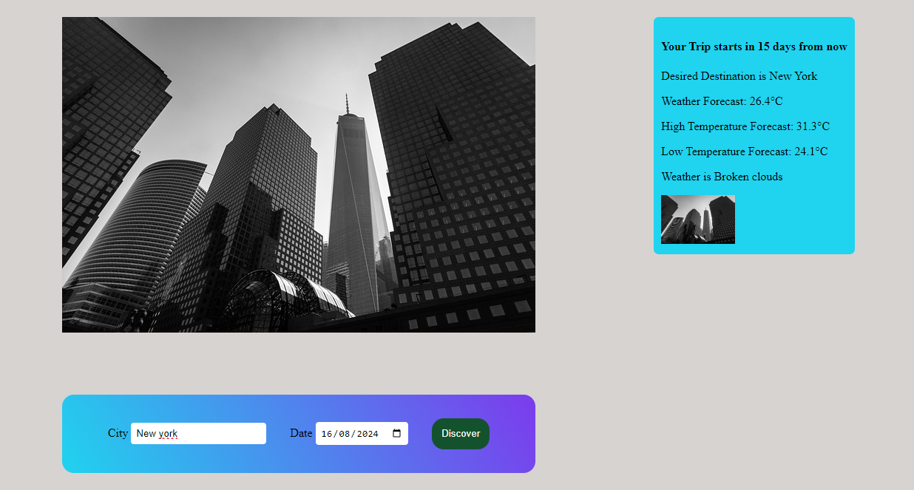

    

 This is an Udacity web development capstone Project. It is a Travel app that provides users with functionalities such as setting present and future dates of Travel and visualizing the locations through the data gotten from the request API  

 

## About the Project

The Project required that data be extracted from three different API's. Most of its functionalities were associated with providing the end User with Weather forecasts and data that will help them plan their trips.

In the front end web deveopment, it was necessary that I implement a cohesive and appealing interface for positive User Experience. Terminologies such as layout, styling were implemented using HTML, css and JavaScript.

The back end of the Project was set up to handle Post and Get requests and also manage data.

The Application Programming Interface(API) were used to provide users with travel-related Information.These help provide real-time Information about their desired destination and weather forecast which were cured and extracted

Testing and debugging were also important to ensure that applications funtion as intended and also handle unexpected errors

## Environment Variables to run the Project

WEATHER_API_KEY=xxxxx-xxxx-xxxx
PIXABAY_API_KEY=xxx-xxx-xxx
USER=xxx-xxx-xxx

## Prerequisites

Web Browser
Text Editor or Integrated Development Environment(IDE) - Visual studio code, JetBrains
Node.js
Node Package Manager

## Installing

npm install ---> for installing required dependencies from the Node Package Manager

The env file is to be added to the gitignore file

## Testing

Install jest and run the command npm run test in the command line (Terminal) to get results